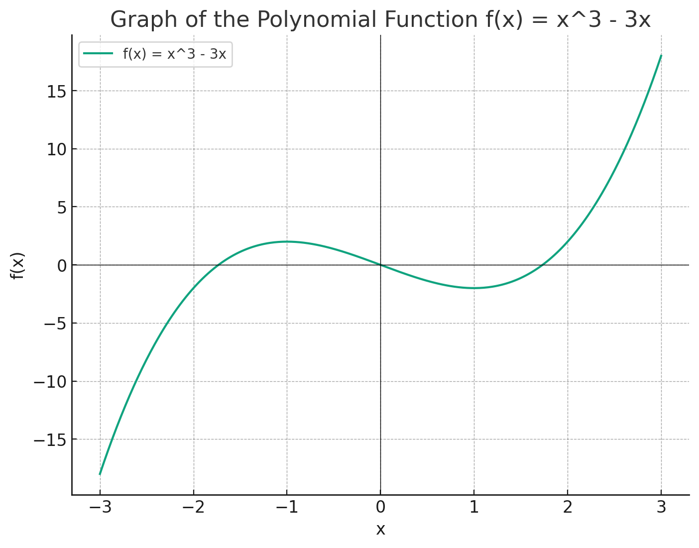

# Polynomial Regression

Polynomial functions are a type of mathematical function that can be represented as a sum of terms, each consisting of a variable raised to a non-negative power and multiplied by a coefficient. 

In graphs, polynomial functions often create curved structures, even those like a "w" shape. 

for example:

$f(x) = x^3 - 3x$

This creates the following shape in a graph:

We get this wave because of the value of $x$, plotted along the bottom. When x is close to zero, our polynomial function will have a smaller value, dipping lowest when $x=1$. This is simply because a negative number multiplied by a negative number is a positive number. 

